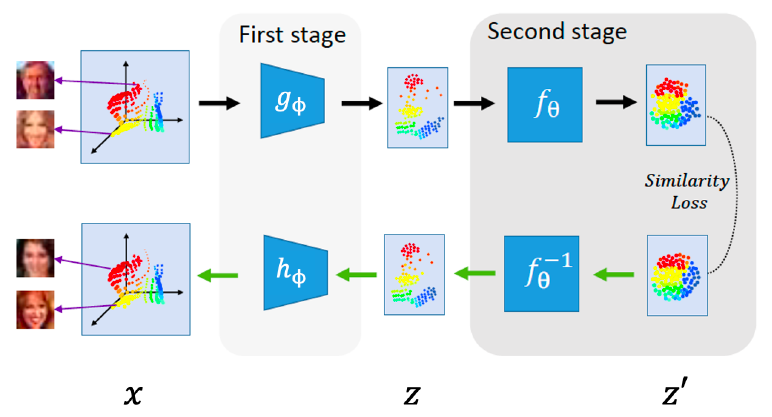

# Enhancing by Decoupling: Exploration of a Unified VAE Framework
## Author
Zhiyuan Wu (zhiyuan.wu@anu.edu.au)

Dan Li (dan.li@anu.edu.au)

Xinhui Bian (xinhui.bian@anu.edu.au)

## Dataset
Our model is deployed on [CelebAMask-HQ dataset](https://github.com/tkarras/progressive_growing_of_gans) (2020), which generates 30,000 high-resolution face images from [CelebA](http://mmlab.ie.cuhk.edu.hk/projects/CelebA.html).

## Platform
The training and testing process will be implemented on MLCV1 Server with 8 Nvidia GeForce RTX 2080Ti GPU, 11GB memory each.

## Model

As shown in the figure, our model adopts a deterministic autoencoder and cascades it with a strictly invertible network, which entails from conventional VAE frameworks the encoder-decoder structure for data reconstruction and the strucural constraint on the feature manifold for potential feature sampling.
Our main modification focuses on decoupled training of two stages: the deterministic autoencoder ($g_\phi$ for the encoder and $h_\phi$ for the decoder) is optimized using original data $x$ at the first stage, producing respective intermediate features $z$, and at the second stage, given these features $z$ as the input, we separately train a strictly invertible network $f_\theta$ to map them to their dual forms $z'$ in the feature manifold which approximates the normal distribution; during generation, we sample potential features $z'$ from the normal distribution, feeding it to $f_\theta^{-1}$, i.e. the inverse of the invertible mapping $f_\theta$, and again feeding the resulting potential intermediate feature $z$ into the decoder $h_\phi$ at the first stage.

The training objective of the first stage is to minimize the mean square error (MSE) loss

  

  

where $x^{(i)}$ denotes the $i$-th training sample and $N$ is the size of the dataset. For the second stage, the objective becomes the maximization of

  

where $p_{z'}$ denotes the normal distribution and $\left|\partial f_\theta/\partial z\right|$ denotes the Jacobian determinant.
This loss encourages the invertible mapping $f_\theta$ to have a normal-distributed co-domain.